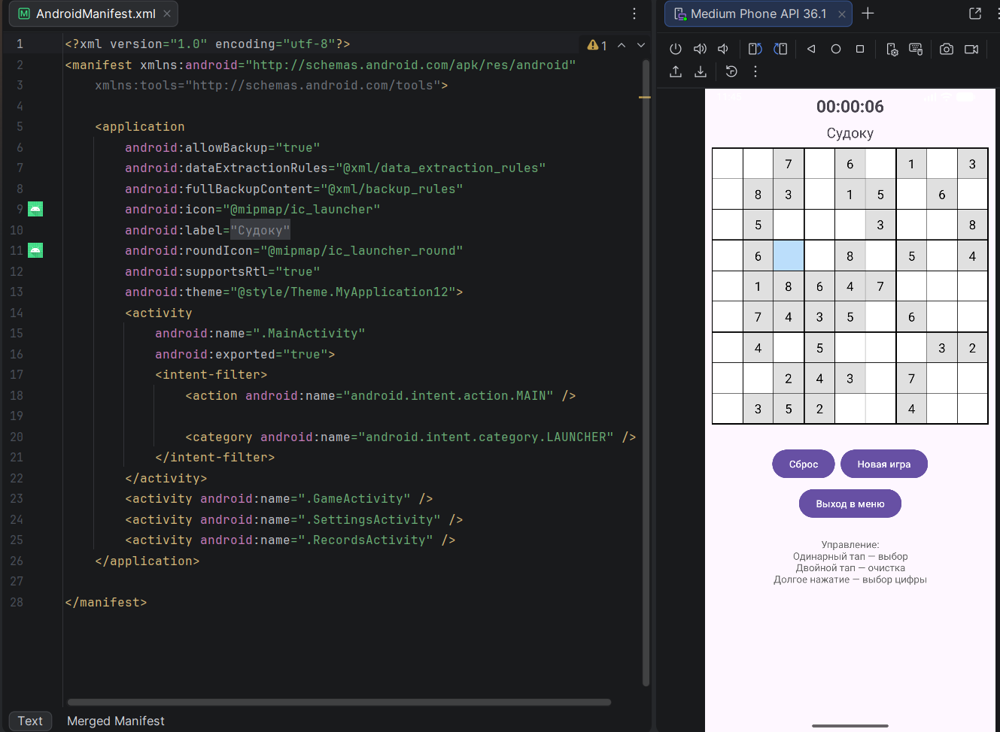
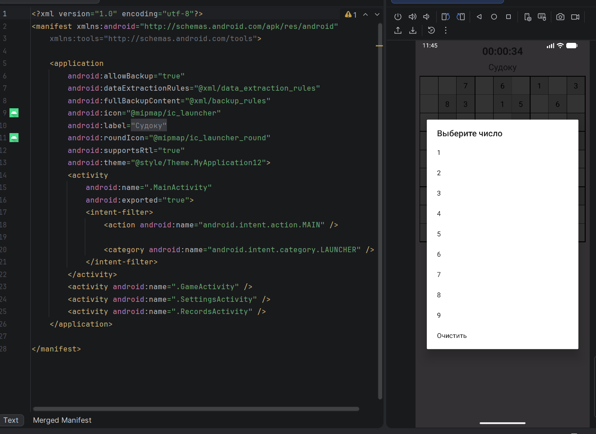

# Практическая работа №13: Обработка жестов

**Выполнил:**  
Петросян Рубен Суренович  
Группа: ИНС-б-о-24-1  
Направление: 09.03.02 «Информационные системы и технологии»

---

## Цель работы

Изучить механизмы обработки сенсорных жестов в Android. Научиться создавать собственные обработчики для распознавания свайпов (смахиваний) и других движений пальца по экрану. Интегрировать обработку жестов в игровое приложение (вариант – «Судоку»).

---

## Ход работы

Добавил в предыдущий проект "Судоку" управление жестами, а так же для удобства выделение клетки синим цветом, чтобы было видно с какой идет взаимодействие

**Рисунок 1** — Новый интерфейс игрового поля

По длительному нажатию всплывает окно для выбора цифры на заполнение (так же для удаления цифры для удобства)

**Рисунок 2** - Окно действий

Так же по двойному нажатию так же происходит очистка клетки, если она не заполнена изначально при создании игры

## Контрольные вопросы

### 1. Что такое MotionEvent? Какие основные типы событий (actions) в нём существуют?
MotionEvent — это объект, который хранит всю информацию о касании экрана. Основные события:

ACTION_DOWN — палец коснулся экрана.
ACTION_MOVE — палец двигается по экрану.
ACTION_UP — палец оторвался от экрана.
ACTION_CANCEL — жест прерван (например, пришло уведомление).

### 2. Для чего используется GestureDetector? В чём его преимущество?
GestureDetector упрощает распознавание сложных жестов (свайпы, долгое нажатие, двойной тап). Преимущество: не нужно вручную высчитывать координаты и скорость — класс сам анализирует последовательность MotionEvent и вызывает готовые методы.

### 3. Какой метод GestureDetector отвечает за свайп? Какие параметры принимает?
За свайп отвечает метод onFling(MotionEvent e1, MotionEvent e2, float velocityX, float velocityY).
Параметры: точка начала жеста (e1), точка конца (e2), скорость по X и Y в пикселях/сек.

### 4. Зачем в методе onDown() возвращать true?
Если onDown() вернёт false, система не будет передавать этому слушателю последующие события (MOVE, UP, FLING). Возврат true говорит: «Я обрабатываю этот жест, дайте мне остальные события».

### 5. Как отличить горизонтальный свайп от вертикального?
Сравниваем абсолютные значения разницы координат: если |diffX| > |diffY| — горизонтальный, иначе вертикальный. Затем проверяем, превышает ли расстояние и скорость пороговые значения.

### 6. Что такое пороговые значения (threshold) и зачем они нужны?
Threshold — это минимальные значения расстояния и скорости, при которых движение считается свайпом. Они отсекают случайные мелкие дрожания пальца, чтобы свайп срабатывал только на осознанные движения.

### 7. Как заставить View реагировать на сенсорные события? Какой слушатель для этого используется?
Нужно установить слушатель View.OnTouchListener через view.setOnTouchListener(...). В методе onTouch(View v, MotionEvent event) обрабатываются все касания.

### 8. Какие ещё жесты можно распознать с помощью GestureDetector? Назовите не менее трёх.

onLongPress — долгое нажатие.